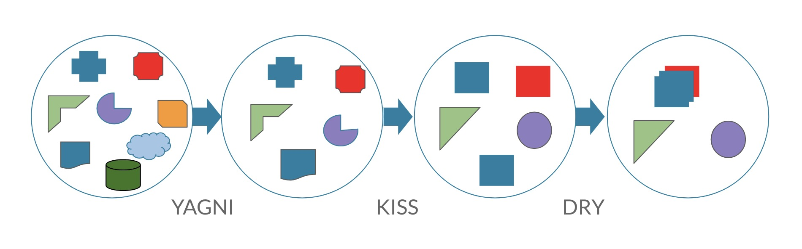

### 1. BDUF — Big Design Up Front (Сначала большое проектирование)

    
Продумать, спроектировать, определить приоритеты, построить архитектуру

1. **Продумать** - Прежде чем переходить к реализации, убедитесь, что все продумано.
2. **Спроектировать** - Разработчик должен сначала завершить проектирование. После этого проект можно реализовать.
3. **Определите приоритеты** - Разделите требования на несколько этапов, определите приоритеты, начинайте с этапа с наивысшим приоритетом.
4. **Построить архитектуру** - Обсудите архитектуру проекта с командой и другими людьми, которые участвуют в проекте до старта.

### 2. YAGNI — You are not gonna need it (Вам это не понадобится)

    
Реализовывать только то что нужно, подчищать ненужный код, не добавлять функционал, о котором не просят

1. **Реализуйте только то, что нужно** здесь и сейчас, а не в теории, что оно пригодится в будущем.
2. **Подчищайте ненужный код** (найдите через Git историю при надобности).
3. **Не добавлять новый функционал, о котором его не просят** (благими намерениями без должной проверки вы только добавите багов).

### 3. KISS — Always Keep It Simple, Stupid (будь проще)

    
Не большие методы, каждый метод решает одну проблему

1. **Не большие методы** (40-50 строк)
2. **Каждый метод решает одну проблему**
3. **Модификация кода не должна вызывать трудностей**
4. **Система работает лучше всего, если она не усложняется без надобности**
5. **Не устанавливайте целую библиотеку ради одной функции из неё**
6. **Не делай того, что не просят**
7. **Писать код необходимо надежно и «дубово»**

### 4. DRY — Don’t Repeat Yourself (Не повторяйся)

    
Избегать копирование кода, выносите общую логику

1. **Избегайте копирования кода**
2. **Выносите общую логику**
3. **Прежде чем добавлять функционал, проверьте в проекте, может, он уже создан**
4. **Константы**

### 5. Бритва Оккама

    
Избегать копирование кода, выносите общую логику

1. **Не нужно создавать лишние сущности без необходимости в них.**
1. **Всегда начинайте с максимально простого кода, затем увеличивайте сложность по мере необходимости.**

### 6. MVP - Minimum viable product
Предполагает создание минимально необходимой функциональности, которая помогает понять, как продукт работает в реальных условиях и нравится ли он пользователям.

### 7. PoC - Proof of concept (доказательство концепции)
Представляет собой его урезанную версию. Он используется на этапе до MVP и предназначен только для того, чтобы подтвердить или опровергнуть необходимость дополнительной функциональности.
По сути, PoC — своего рода расходный материал, временный код. Его пишут не для реализации, а для демонстрации проекта. Включать PoC в реальный продукт, в принципе, можно,
но имейте в виду, что для доказательства одной концепции, бывает, приходится создавать несколько PoC